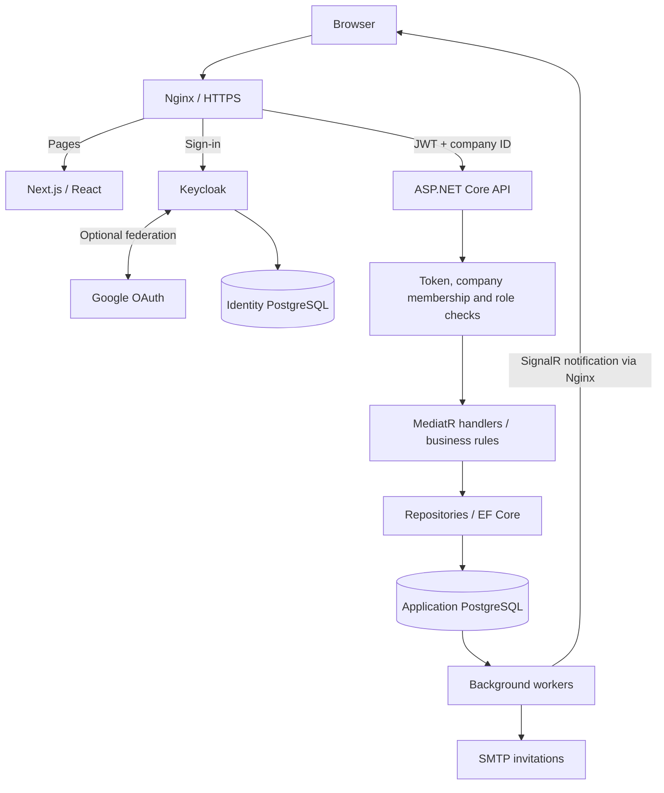
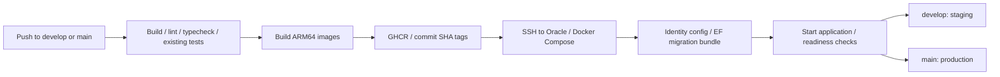

# InventoryManagement

A multi-company inventory and purchasing application built with ASP.NET Core and Next.js.

[Live demo](https://inventory-yamanemirhan.duckdns.org/) · [Frontend guide](InventoryManagement.Web/README.md) · [Identity and deployment configuration](deploy/keycloak/README.md)

## Features

- Multiple company memberships, company switching, Owner/Manager/Operator/Viewer roles and platform administration.
- Products, warehouses, suppliers, stock transfers, physical counts and minimum-stock warnings.
- Purchase orders with partial receipts, supplier returns and concurrent-update protection.
- Filtered reports, CSV/XLSX import/export, activity history and company knowledge resources.
- Bulk products, warehouses, suppliers, opening stock and draft purchases: templates, row previews, downloadable errors and atomic, company-scoped imports with duplicate-upload protection.
- Email/password and optional Google sign-in, verified email invitations, custom account screens and SignalR updates.
- Turkish/English UI, responsive layouts and light/dark themes.
- Admin-only server/container dashboard, OpenTelemetry logs/traces/metrics and safe staging diagnostics.

## Technology

| Layer | Stack |
| --- | --- |
| Frontend | Next.js 16, React 19, TypeScript, Tailwind CSS |
| State and forms | TanStack Query, Redux Toolkit, React Hook Form, Zod |
| API and architecture | ASP.NET Core 10, C#, REST/OpenAPI, MediatR/CQRS, FluentValidation |
| Persistence | PostgreSQL 17, EF Core 10, Npgsql, migrations |
| Identity | Keycloak 26, OpenID Connect, Authorization Code + PKCE, JWT, Google OAuth |
| Background work | SignalR, .NET hosted services, PostgreSQL outbox, MailKit/SMTP, ExcelJS |
| Hosting and delivery | Oracle Cloud Ubuntu ARM64, Docker Compose, Nginx, HTTPS/Certbot, DuckDNS, GitHub Actions, GHCR |
| Operations | OpenTelemetry, Prometheus, Grafana, Loki, Tempo, health checks, request IDs, rate limits, Gitleaks and GitGuardian |

Oracle Cloud hosts the services; PostgreSQL stores the data. Redis and RabbitMQ are not required by the current implementation.

## Application flow



`Domain` contains business entities; `Application` contains commands, queries and validation; `Infrastructure` implements persistence; `Api` exposes endpoints; `Web` owns the UI.

Companies share the application database. Membership checks, company-scoped queries, write guards and company-aware foreign keys enforce separation. Platform administrators have explicit cross-company access. Business changes and audit/outbox entries commit together; row versions prevent stale stock and purchase-order writes. SignalR sends change notices and the client refetches authorized data.

## Run locally

Requires **.NET 10 SDK**, **Node.js 24**, **Docker Compose** and a matching **dotnet-ef 10** tool.

1. Copy `deploy/keycloak/.env.example` to `.env.identity`. Fill both Keycloak password fields with distinct random values. Google and SMTP are optional for local startup.
2. Copy `InventoryManagement.Web/.env.example` to `InventoryManagement.Web/.env.local`.
3. From the repository root, start the databases/identity service and apply migrations:

```sh
docker compose up -d postgres
docker compose --env-file .env.identity -f compose.identity.yml up -d
dotnet restore InventoryManagement.slnx
dotnet ef database update --project InventoryManagement.Infrastructure --startup-project InventoryManagement.Api -- --environment Development
```

4. In one terminal, run the API:

```sh
dotnet run --project InventoryManagement.Api --launch-profile http
```

5. In another terminal, run the frontend:

```sh
cd InventoryManagement.Web
npm ci
npm run dev
```

Open [the app](http://localhost:3000). The API is at `http://localhost:5138`; [local Keycloak](http://localhost:8088/admin/) uses the administrator credentials from `.env.identity`. Register an application account and create a company to start. Keycloak administrator credentials are separate from application users.

The local business database uses `postgres` / `postgres` on loopback only. These development defaults must never be reused on a server. Production and staging require explicit credentials and HTTPS; their blank env templates are separate from local setup.

## Delivery flow



Each environment has separate application and identity services, PostgreSQL volumes and credentials. Nginx exposes HTTPS; service/database ports bind to loopback. Deployment selects the exact commit, serializes server changes and records the healthy image version after readiness checks. Rollback changes application images; it does not downgrade the database.

Server/Google/SMTP values stay in protected env files and GitHub Actions Secrets. Only blank env files, secret-free templates and reusable deployment scripts are tracked. See the [configuration guide](deploy/keycloak/README.md) before deploying your own instance; the supplied server helper targets this project's domains and layout.

See [system monitoring](deploy/observability/README.md) for admin access, retention and diagnostics.

## Bulk import

Owners/Managers use **Bulk data import** (`/imports`). Download a CSV/XLSX template, replace the example row and upload up to 1000 rows / 1 MB. Preview checks all rows before saving; any error rejects the whole batch. Download the full row/column error report to correct the file.

Import products, warehouses and suppliers first. Stock and purchase templates reference company SKUs, unique warehouse names and supplier emails; a reference workbook is available. Opening stock imports never overwrite existing stock. Purchase rows sharing `OrderKey` create one draft (up to 100 items); this key only groups the current file. Prices use a dot and at most two decimals. Stock changes, history and import receipts commit together; repeat uploads of identical contents do not create duplicates.

## Scope and limitations

- Realtime and invitation dispatch currently assume one API instance per environment. Scaling requires coordinated workers and a shared SignalR transport; delivery is not exactly-once.
- Knowledge resources prepare data for future RAG. No chatbot, embedding pipeline or vector database is included.
- WhatsApp/SMS automation is deferred: production delivery requires provider setup and potentially paid messages. No paid provider is activated.
- Backup/restore tooling is included, but installation, off-host storage and recovery drills must be configured and verified by the operator. Deployment alone does not enable them.
- Secrets and dependency checks reduce risk; they are not a penetration-test or compliance certification.

## Validation

```sh
dotnet build InventoryManagement.slnx --configuration Release
dotnet test InventoryManagement.UnitTests --configuration Release
dotnet test InventoryManagement.IntegrationTests --configuration Release
```

Integration tests require Docker. Frontend checks: `npm run lint`, `npm run typecheck`, `npm run build`. CI also scans Git history for secrets.
